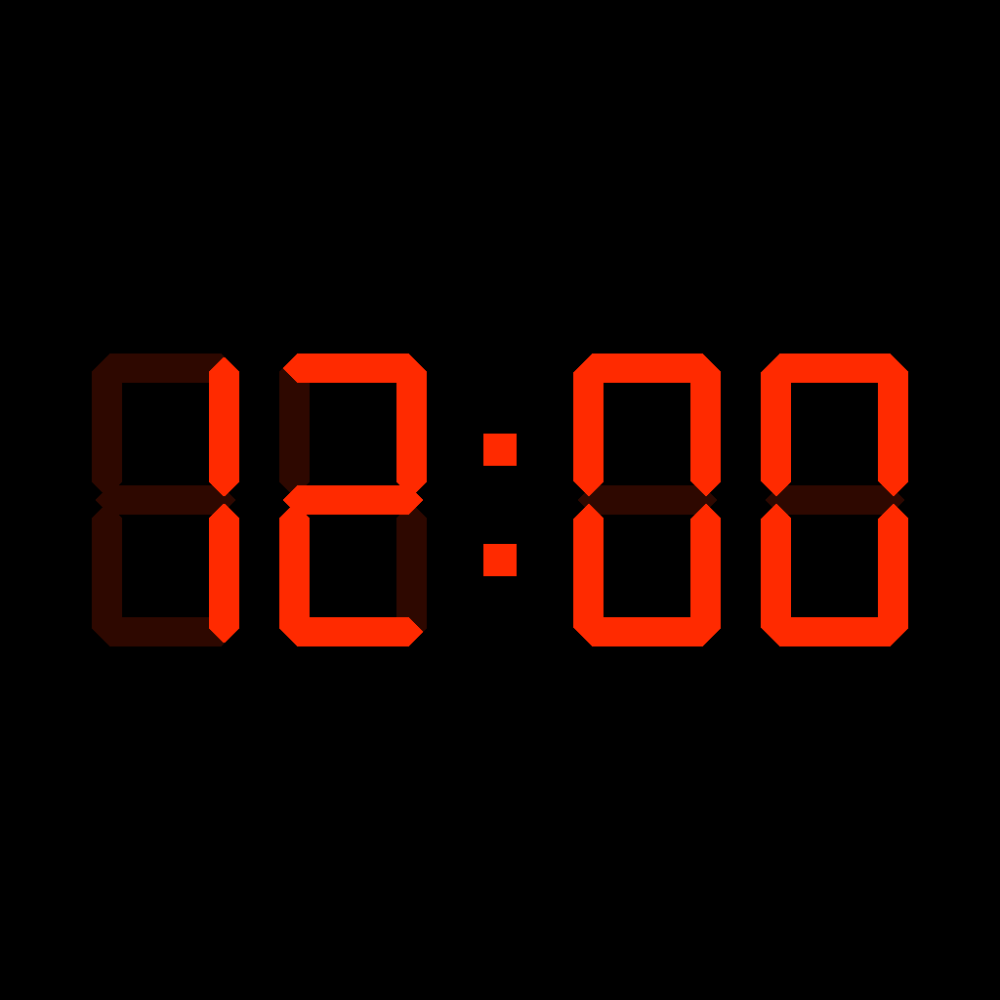

# AutoSnooze

A bedside night clock for iPhone: the current time as a red 7-segment LED
display on a pure black background. Built with SwiftUI, deployment target
iOS 17 (works on iPhone 12 and later).



## Features

- Classic 7-segment LED digits, custom-drawn (no font), with faint "ghost"
  segments like a real LED panel
- Follows the system 12/24-hour setting; AM/PM indicator in 12-hour mode
- Works in portrait and landscape — the display reflows on rotation
- The screen never sleeps while the app is in the foreground
- Tap the display to reveal a brightness slider (auto-hides after ~4 s);
  the dim level is remembered across launches
- Two independent alarms, each with an enable toggle, time, and sound
  (Chime, Gong, Bell, or Beep — all synthesized, bundled as WAVs)
- An alarm plays its sound **once** — no repeat, no snooze, no dismiss.
  Alarms sound even if the silent switch is on.

## Important

**Alarms only fire while the app is open in the foreground.** This is by
design: it's a bedside clock meant to stay on all night. Leave the app open
and the phone on its charger.

## Building

Open `AutoSnooze.xcodeproj` in Xcode (16 or newer), select your development
team under Signing & Capabilities, and run on your iPhone.

Command line:

```sh
xcodebuild -project AutoSnooze.xcodeproj -scheme AutoSnooze \
  -destination 'generic/platform=iOS' build
```

## Signing

The app is signed with the paid Apple Developer team **Dialogs Apps, Inc.**
(54MH33556M), so development installs stay valid for a year (current profile
expires 2027-07-17). To renew, just rebuild and reinstall — or run
`Scripts/refresh-install.sh`, which builds with `-allowProvisioningUpdates`
and installs to the iPhone via `devicectl` (UDID pinned in the script).

Historical note: the app was originally signed with a free Apple ID (7-day
profiles) and a launchd agent re-installed it daily at 8 AM. That agent
(`com.dialogs.alarmclock.refresh`) was removed on 2026-07-17 when the project
moved to the paid team.

## Settings

Tap the dim gear button in the bottom-right corner to set the alarms.
Indicator dots (AL1 / AL2) under the clock light up when an alarm is enabled.

## License

[MIT](LICENSE)
